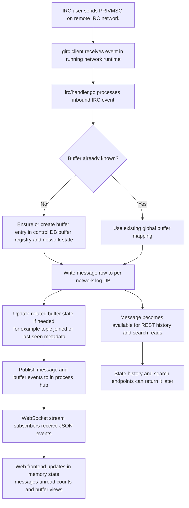

# Lurker architecture

This document is for AI agents and other technical readers. It describes the current application structure, storage model, API surface, and important invariants.

## Purpose and scope

Lurker is a private, single-user IRC bouncer plus web client backend.

Current in-repo scope:

- Go backend service
- disk-served web UI
- control-plane SQLite database
- one SQLite log database per network
- REST API for state, history, search, and network management
- WebSocket stream for live updates and client commands

Non-goals unless explicitly requested:

- multi-user support
- public-internet deployment assumptions
- app-layer authentication
- SaaS-style tenancy or account models

## High-level architecture

Main components:

- `main.go`: process setup, config loading, DB open, IRC manager startup, HTTP server startup
- `config.go`: environment and `config.yaml` bootstrap loading
- `api/`: REST and WebSocket API surface
- `irc/`: persistent IRC connection lifecycle and event handling
- `db/`: control DB, per-network log DBs, migrations, and query helpers
- `hub/`: in-process pub/sub used to fan live events to WebSocket clients
- `web/`: Vite + TypeScript frontend

Runtime flow:

1. process loads config from env and optional `config.yaml`
2. control DB and configured per-network log DBs are opened
3. bootstrap networks from `config.yaml` are upserted into control DB and started
4. HTTP API and web UI are served from the same Go process
5. IRC events are persisted to SQLite and published to the hub
6. WebSocket clients receive hub events and issue commands back to the backend

## Configuration model

Primary config inputs:

- `DATA_DIR` default `./data`
- `ADDR` default `:8080`
- `CONFIG_PATH` default `./config.yaml`
- CLI flag `--web-dir` to serve built frontend from disk

### Important invariant: `config.yaml` is bootstrap-only

`config.yaml` is seed input, not runtime source of truth.

On startup:

- YAML-defined networks are inserted into control DB if missing
- those seeded networks are started

After startup:

- network definitions are managed through the API and stored in `control.db`
- connect/disconnect is managed through the API
- YAML is not the live config database

## Storage model

### Control DB

Path:

- `data/control.db`

Purpose:

- canonical network definitions
- global buffer registry
- schema migration bookkeeping

Important tables:

- `networks`
- `buffer_registry`
- `schema_migrations`

The `networks` table stores:

- stable numeric network ID
- human-facing network name
- connection settings like host/port/tls/nick/realname/SASL
- `sort_order` for persistent sidebar ordering

The `buffer_registry` table stores the global API-facing buffer ID namespace.

### Per-network log DBs

Path pattern:

- `data/<normalized-network-name>.db`

Purpose:

- messages for that network
- per-buffer mutable state such as topic/joined/last seen

Important property:

- message history is sharded by network DB
- API-facing buffer IDs are global, but message rows live in each network's log DB

### Why two storage layers exist

The control DB handles global coordination:

- network metadata
- network ordering
- global buffer registry

The per-network DBs handle network-local data:

- message logs
- channel state
- read state

This avoids putting all message history for all networks into one DB while still allowing one global API surface.

## Network model

A network is:

- one logical IRC network row in the control DB
- zero or one active IRC client runtime at a time
- one per-network log database on disk

Important assumptions:

- network names are expected to be stable after creation
- rename behavior is conservative because log DB filenames derive from network names
- deleting a network removes it from the control DB and closes its log DB handle, but the log DB file is intentionally retained

## Buffer model

Buffer kinds:

- `status`
- `channel`
- `query`

Global/API view:

- each buffer has a stable ID from `buffer_registry`
- clients use this global buffer ID for history, active buffer selection, and mark-read operations

Per-network/log DB view:

- the backend maps the global buffer ID to the network-local buffer row before querying messages or updating read state

Important invariant:

- clients should treat buffer IDs as globally unique stable identifiers

## Process startup and lifecycle

From `main.go`:

- load config
- open `MultiStore`
- create event hub
- create IRC manager
- start bootstrap IRC networks if configured
- serve API and UI
- on shutdown, stop HTTP server and wait for IRC runtimes to exit

Web serving modes:

- default: API-only mode; no web UI served from `/`
- `--web-dir ./web/dist`: serve built frontend from disk
- container image: starts with `--web-dir /app/web/dist`

## IRC runtime architecture

`irc.Manager` owns:

- IRC connection runtimes per network
- current per-network connection state
- methods for send/join/part
- outbound message logging

Each running network has:

- a cancellable runtime context
- a `girc.Client`
- an event handler that persists inbound IRC events and publishes hub events

Observed connection states include:

- `connecting`
- `connected`
- `disconnected`

### Event persistence model

Inbound IRC events are handled in `irc/handler.go`.

The handler is responsible for:

- ensuring buffers exist
- writing messages to the correct network log DB
- updating buffer state like topic/joined
- publishing stream events to the hub

Outbound messages are also persisted through `Manager.LogOutbound()` because the connected IRC servers may not provide echo-message in a way the app can rely on.

### Normal IRC message flow



## Event hub and streaming model

`hub/` provides in-process fanout from backend events to connected WebSocket clients.

Backend producers include:

- IRC message persistence
- buffer creation
- buffer state changes
- network state changes
- member list publication

The WebSocket endpoint subscribes to the hub and forwards events as JSON.

## REST API

Base routes currently exposed:

- `GET /health`
- `GET /healthz`
- `GET /whoami`
- `GET /api/state`
- `GET /api/buffers/{id}/history`
- `GET /api/search?q=...`
- `POST /api/networks`
- `POST /api/networks/reorder`
- `PATCH /api/networks/{id}`
- `DELETE /api/networks/{id}`
- `POST /api/networks/{id}/connect`
- `POST /api/networks/{id}/disconnect`

### `GET /whoami`

Returns service metadata such as:

- app name
- version
- git hash
- build time

Useful for identifying the running instance.

### `GET /api/state`

Purpose:

- full snapshot for initial client hydration

Returns:

- `networks`
- `buffers`
- `initial_messages` keyed by buffer ID
- `members` keyed by buffer ID

Current behavior:

- includes recent messages for each buffer
- includes network `sort_order`
- network list order is the server-side canonical order

### `GET /api/buffers/{id}/history`

Purpose:

- page older messages for one global buffer ID

Query parameters:

- `before`
- `limit`

### `GET /api/search`

Query parameters:

- `q` required
- `network` optional
- `buffer` optional

Search runs against stored messages, not live IRC state.

### `POST /api/networks`

Creates a network row in control DB and opens its log DB.

Expected fields include:

- `name`
- `host`
- `port`
- `tls`
- `nick`
- optional `realname`
- optional SASL fields

New networks are appended to the end of sidebar order by assigning the next `sort_order`.

### `POST /api/networks/reorder`

Purpose:

- persist sidebar network ordering

Request body:

```json
{ "ids": [2, 1, 3] }
```

Behavior:

- expects a complete ordered list of all network IDs
- updates `sort_order` transactionally
- returns the reordered `networks` list

### `PATCH /api/networks/{id}`

Updates network properties.

Notes:

- patch semantics are partial for the existing editable fields
- if the network name changes, the backend renames the log DB file conservatively

### `DELETE /api/networks/{id}`

Behavior:

- stops the IRC runtime if running
- removes the network from control DB
- closes the log DB handle
- retains the on-disk log DB file

### Connect/disconnect routes

- `POST /api/networks/{id}/connect`
- `POST /api/networks/{id}/disconnect`

These control IRC runtime state independently of the bootstrap YAML.

## WebSocket API

Endpoint:

- `/api/stream`

The stream serves two roles:

- server-to-client event stream
- client-to-server command channel

### Client commands

Current client command envelope fields:

- `type`
- `req_id`
- `buffer_id`
- `network_id`
- `channel`
- `content`
- `before`
- `limit`
- `message_id`

Supported command types:

- `send`
- `history`
- `join`
- `part`
- `mark_read`

Command semantics:

- `send`: send message to a non-status buffer
- `history`: fetch recent or older messages for a buffer
- `join`: join a channel on a network
- `part`: part the channel identified by buffer ID
- `mark_read`: persist last seen message for a buffer

### Generic command responses

Ack envelope:

```json
{ "type": "ack", "req_id": "r1" }
```

Error envelope:

```json
{ "type": "error", "req_id": "r1", "message": "..." }
```

### Stream event types

Currently published events include:

- `message`
- `buffer_created`
- `buffer_update`
- `network_state`
- `member_list`
- lightweight presence-style events may also be published

Important event shapes from `irc/handler.go`:

`message`

- `id`
- `network_id`
- `buffer_id`
- `msgid`
- `ts`
- `sender`
- `account`
- `kind`
- `target`
- `content`

`buffer_created`

- `id`
- `network_id`
- `name`
- `kind`
- `created_at`

`buffer_update`

- `id`
- `network_id`
- `topic`
- `joined`
- `last_seen_id`

`network_state`

- `network_id`
- `state`

`member_list`

- `network_id`
- `buffer_id`
- `channel`
- `members`

## Frontend architecture

Frontend lives in `web/` and is intentionally simple.

Current characteristics:

- Vite + TypeScript
- mostly single-file app logic in `web/src/main.ts`
- local UI state in memory plus some localStorage-backed layout preferences
- server is source of truth for networks, buffers, messages, and read state

### Frontend source-of-truth rules

Server-backed state:

- networks
- network ordering via `sort_order`
- buffers
- messages
- read state
- member lists

Client-only persisted layout state:

- collapsed sections
- pinned buffers

Important invariant:

- network ordering is no longer a frontend-only preference; it is shared persistent state stored in the control DB

### Hydration model

On load:

1. fetch `/api/state`
2. populate maps for networks, buffers, messages, and members
3. infer unread counts client-side from `last_seen_id`
4. connect WebSocket stream
5. apply incoming events incrementally

## Testing strategy

For IRC package tests, prefer unit tests that inject synthetic `girc.Event` values or fake connection hooks over socket-level fake IRC servers.

Rationale:

- Lurker should test its own translation layer and state management
- the `girc` library is treated as trusted for protocol parsing and wire-level behavior
- fast deterministic tests are preferred over in-process network servers where possible

This means tests should primarily cover:

- IRC event -> SQLite persistence
- IRC event -> hub publication
- manager lifecycle/state transitions
- retry/failover selection logic via injected connector seams

Only add true transport-level integration tests when validating behavior that is specifically about Lurker's own network integration rather than `girc` internals.

## Build and developer workflow

Preferred commands come from `Taskfile.yml`:

- `task dev`
- `task dev-web`
- `task web-install`
- `task web-dev`
- `task web-build`
- `task test`
- `task lint`
- `task build`
- `task up`
- `task down`

## Privacy and deployment assumptions

Assumptions baked into the current architecture:

- single user
- trusted private network only
- no app-layer authentication
- not intended for public exposure

Typical deployment expectations:

- run on loopback or Tailscale-reachable host
- persist the entire `data/` directory
- optionally serve built frontend from the same Go binary

## Important invariants and gotchas

- `config.yaml` is seed input only after startup
- preserve `data/` to keep control DB and all log DBs
- network names should be treated as stable
- global buffer IDs come from control DB, but messages live in per-network DBs
- deleting a network does not delete its historical log DB file
- sidebar network order is persisted in `networks.sort_order`
- `/whoami` is the preferred endpoint for identifying a running instance

## Suggested future documentation split

If this file grows too large, split into:

- `ai-docs/architecture.md`
- `ai-docs/rest-api.md`
- `ai-docs/websocket-protocol.md`
- `ai-docs/storage.md`
