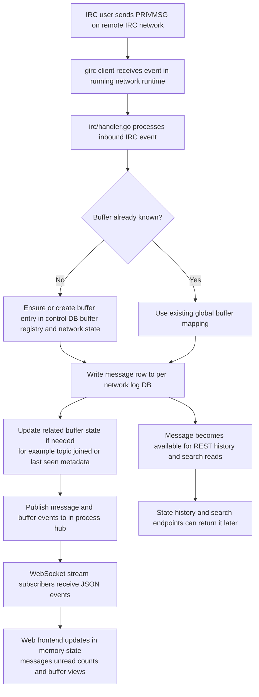

# IRC runtime and preview pipeline

This document covers the IRC client runtime, event persistence, the URL preview pipeline that hooks off the message flow, the presence event model, channel list handling, and the ignore system. See [ARCHITECTURE.md](ARCHITECTURE.md) for the overview, [storage.md](storage.md) for the DB layout, and [websocket-protocol.md](websocket-protocol.md) for the events published downstream.

## IRC runtime architecture

`irc.Manager` owns:

- IRC connection runtimes per network
- current per-network connection state
- methods for send/join/part
- outbound message logging

Each running network has:

- a cancellable runtime context
- a `girc.Client`
- an event handler that persists inbound IRC events and publishes hub events

Observed connection states include:

- `connecting`
- `connected`
- `disconnected`

After successful IRC registration, the handler sends saved per-network connect commands with `SendRaw` in stored order, logs send failures as warnings, then joins configured autojoin channels. Commands are reloaded from storage before each reconnect. Connect commands may contain secrets and are loaded from config/API storage rather than exposed in `/api/state`.

TLS connections use Go's default maximum TLS version on the first attempt. If that attempt fails and TLS was not already capped to TLS 1.2, the manager immediately retries the same server with `MaxVersion = TLS 1.2` plus legacy RSA AES-GCM cipher suites before applying reconnect backoff. YAML servers may set `tls_max_version: "1.2"` to skip the first attempt for known legacy IRC TLS stacks, or `"1.3"` to cap at TLS 1.3.

## Event persistence model

Inbound IRC events are handled in `irc/handler.go`.

The handler is responsible for:

- ensuring buffers exist
- writing messages to the correct network log DB
- updating buffer state like topic/joined
- publishing stream events to the hub

Outbound messages are also persisted through `Manager.LogOutbound()` because the connected IRC servers may not provide echo-message in a way the app can rely on.

### Chathistory gap backfill

`irc/chathistory.go` fills missed-message gaps using the IRCv3 `draft/chathistory` extension when the server supports it (Ergo, UnrealIRCd; not Libera/Solanum). Requested via `SupportedCaps` in `buildClient` — girc only REQs caps the server advertises, so it's a silent no-op elsewhere.

- Channels are requested on **self-JOIN** (`CHATHISTORY AFTER <target> timestamp=<newest stored ts> <limit>`), which covers both reconnects and rejoins after a kick. Query buffers are requested once per connection right after CONNECTED. Buffers with no stored messages are skipped (no anchor).
- Replayed messages arrive in a `chathistory` batch. The batch **target** decides the buffer — never the message source (our own replayed PMs would otherwise misfile under our own nick).
- Replayed rows are persisted with `LogMessageInput.Backfill = true`: the row's UUIDv7 id encodes the *message* timestamp instead of insert time (plus a process-wide sequence in the rand_a bits so same-millisecond messages keep their delivery order), so id-ordered reads (`RecentLogMessages`, `last_seen_id` comparisons) stay chronological despite the late insert. Duplicates drop on the `(buffer_id, msgid)` unique index. Known limitation: live rows encode local arrival time while backfilled rows encode server time, so ordering across the two at the reconnect boundary is only as good as the local↔server clock skew — acceptable for a single-user bouncer on NTP-synced hosts.
- No per-message hub events are published for replays; one `history_backfill` event per batch announces the insert count. Clients respond by refetching the buffer's recent window and merging by id (web `ws-router.ts`, tui `requestBackfillRefetch`, apple `refetchBackfilledHistory`).
- Pagination: a full page triggers another AFTER request anchored on the newest replayed message's **msgid** (timestamp fallback when it has none — an AFTER timestamp excludes every message sharing that timestamp, so a page boundary inside a same-ms cluster would drop the rest). Bounded by `chathistoryMaxPages` per target per connection; the per-page limit comes from the server's `CHATHISTORY` ISUPPORT token (clamped to 500, default 100 when absent). Hide-tier ignored-sender messages are dropped from storage but still count toward the page size, or a full page would look partial and pagination would stop early. Mute-tier senders are backfilled normally (see "Ignore system" below).

## Normal IRC message flow

## URL preview pipeline

The `preview/` package resolves HTTP(S) URLs mentioned in user-authored messages into inline previews (images + OpenGraph cards). The pipeline is deliberately off the message hot path:

1. `irc/handler.go` and `irc.Manager.LogOutbound` call `PreviewEnqueuer.Enqueue(networkID, bufferID, messageID, content)` only for kinds `privmsg`, `notice`, `action`. System events (joins, modes, etc.) are skipped.
2. `preview.Service` owns a bounded worker pool (default 4, configurable). Enqueue is non-blocking: a full queue drops the job with a warning rather than stalling IRC handling.
3. For each worker pickup: `ExtractURLs` pulls de-duplicated URLs in message order. For every URL, the worker consults `db.PreviewStore` (the shared `previews.db`) first, honoring `CacheTTL`. On miss, `Fetcher.Fetch` runs the SSRF guard, does a HEAD, and classifies:
   - `image/*` → `kind=image` preview
   - `text/html` → bounded GET capped by `MaxBytes`, parsed for `og:*` meta (falls back to `<title>`)
   - anything else → `kind=none`
   - fetch/SSRF errors → `kind=error`
   YouTube URLs (`youtube.com/watch`, `/shorts/`, `/live/`, `/embed/`, `youtu.be/*`) take a shortcut to the public `youtube.com/oembed` endpoint because the HTML page strips OG tags for non-browser user-agents.
4. Every fetch is written back to `url_previews` (including negative results, to prevent retry storms).
5. `(message_id, url, position)` associations are written to the per-network log DB's `message_previews` table.
6. Only `image`/`opengraph` results are then published as a `preview` event on the hub; the WebSocket writer forwards it verbatim.

On reload, `/api/state` and history endpoints re-attach previews to each `messageDTO` via `Server.attachPreviews`, which groups messages by network, reads `message_previews` from each log DB, and batch-loads the URL rows from `previews.db` with a single `GetMany`. No network calls happen on the read path.

Security notes (all non-negotiable):

- SSRF guard rejects loopback, RFC1918, link-local, multicast, CGNAT, and non-80/443 ports; runs on the initial URL and on every redirect hop
- redirects are capped at 3 via `CheckRedirect`
- body size is capped by `io.LimitReader(resp.Body, MaxBytes)`
- the HTTP client uses a configurable timeout (`Timeout` field, default 5 s)
- the frontend renders OG text via `textContent` only — never `innerHTML` — so OG strings cannot inject markup

Configuration (YAML block `previews:` in `config.yaml`, populates `config.PreviewConfig`):

- `enabled` — set to `false` to disable Enqueue entirely, no workers run
- `max_bytes` — cap per GET (default 512 KiB)
- `timeout_ms` — per-request deadline (default 5000)
- `cache_ttl_hours` — how long a cached row is considered fresh (default 168 = 7 d)
- `workers` — worker pool size (default 4)

Operational tips:

- wiping the preview cache is safe: stop the service, `rm data/previews.db`, restart. Message history is untouched; the `message_previews` link rows stay and will re-populate as URLs are re-fetched on demand (new messages only — there is no backfill job yet).
- error rows are cached under the same TTL as successes. After changing the user-agent or unblocking a host, clear affected rows manually (`DELETE FROM url_previews WHERE ...`) to force re-fetch.

## Event hub and streaming model

`hub/` provides in-process fanout from backend events to connected WebSocket clients.

Backend producers include:

- IRC message persistence
- buffer creation
- buffer state changes
- network state changes
- member list publication
- presence events (joins, parts, quits, kicks, nick changes)
- channel list results
- buffer settings changes
- preview results

The WebSocket endpoint subscribes to the hub and forwards events as JSON. See [websocket-protocol.md](websocket-protocol.md) for the wire format.

## Presence events

`irc/handler_presence.go` and `irc/handler_channel.go` publish `PresenceEvent` (`type: "presence"`) for user-visible state changes:

- **join/part**: channel-scoped, emitted per channel the user joins or leaves. `state` = `"join"` or `"part"`, carries `buffer_id`.
- **quit**: for other users, fanned out to every channel the departing user was known to be in before removal. Self-quits do not fan out per-channel.
- **kick**: emitted on the kicked channel, `state` = `"kick"`, `nick` = kicked nick.
- **nick change**: network-scoped (no `buffer_id`), `state` = `"nick"`, `target` = new nick.

Frontend uses these events for per-buffer presence display when `show_presence_events` is enabled.

## Bot mode (IRCv3)

`irc/bots.go` + `irc/handler_bots.go` implement [IRCv3 bot mode](https://ircv3.net/specs/extensions/bot-mode). girc tracks neither WHO flags nor the 335 numeric, so a per-network `botTracker` (a set of case-folded nicks, shared between the handler and `irc.Manager` so REST snapshots and WS pushes agree) accumulates bot status from three sources:

- **WHO flags** — the ISUPPORT `BOT` mode character appearing in `RPL_WHOREPLY` (352) / `RPL_WHOSPCRPL` (354) flags. girc's own auto-WHO requests `%tacuhnr` (no flags field), so on servers advertising `BOT` we send an extra `WHO <target> %tnf,9` after `RPL_ENDOFNAMES` and on remote joins; query type `9` distinguishes the reply from girc's (`1`) and `Cmd.Who()`'s (`2`). Without `WHOX` we send a plain `WHO` and read 352 flags. Servers that don't advertise `BOT` see no extra traffic.
- **RPL_WHOISBOT (335)** in a WHOIS response.
- **the `bot` message tag** (also `draft/bot`) on any event with a source, covering nicks we never WHO'd.

Only replies to our own `%tnf` query can *clear* bot status — any other WHO reply may simply omit the flag, so those only ever set it. The leading `H`/`G` away indicator is stripped before matching so a network using `G` or `H` as its bot mode character doesn't match every away user.

Bot status is exposed as `ChannelUser.bot` in member lists (and is part of the member-list dedupe hash, so a newly detected bot republishes). Detection during a WHO burst does not publish per nick — `RPL_ENDOFWHO` already republishes the affected member lists. The tracker follows NICK changes, drops nicks on QUIT, and starts empty on every reconnect. Clients render bots with 🤖 in place of the nick identicon (see [nick-identicon.md](nick-identicon.md)).

## Metadata avatars

`irc/avatars.go` + `irc/handler_metadata.go` implement the [IRCv3 metadata extension](https://ircv3.net/specs/extensions/metadata) (`draft/metadata-2`) to read other users' avatar URLs. girc has no METADATA support, so — like bot mode — a per-network `avatarTracker` (case-folded nick → URL, shared between the handler and `irc.Manager`) accumulates avatars.

- **Caps**: `draft/metadata-2` and `batch` are requested via `SupportedCaps` in `buildClient`; girc only REQs caps the server advertises, so it's a silent no-op elsewhere (Ergo supports it; Libera/Solanum do not). `batch` is required because SYNC bursts arrive wrapped in a BATCH — girc does no BATCH buffering of its own, so every batched line reaches the normal handlers in wire order.
- **Subscribe**: on connect (`onConnected`, cap-gated) the client sends `METADATA * SUB avatar`. The server then pushes current values for visible users and unsolicited updates thereafter.
- **Sources**: the unsolicited/batched `METADATA` command (`<target> <key> <visibility> :<value>`), `761 RPL_KEYVALUE` (GET/SYNC replies and SUB pushes), `760 RPL_WHOISKEYVALUE` (inline in WHOIS), and `766 RPL_KEYNOTSET` (clear). Only the `avatar` key and only nick targets are tracked (channel avatars are out of scope). A non-empty value sets, an empty value or `766` clears.
- **Deferred sync**: on `774 RPL_METADATASYNCLATER` (server deferred the burst — e.g. our connect-time SUB, or joining a large/throttled channel), the handler issues `METADATA <target> SYNC` itself so avatars still arrive rather than staying absent indefinitely. It honors the numeric's optional `RetryAfter` seconds (waiting via a timer before sending, clamped to a 300s max against a hostile/broken server) or sends immediately when absent/invalid.
- **Exposure**: only a boolean leaves the backend — the URL stays server-side and is fetched through the SSRF-guarded avatar proxy (see [rest-api.md](rest-api.md) `/api/avatar`). `ChannelUser.has_avatar` rides member-list snapshots; live changes publish an `avatar` WS event (see [websocket-protocol.md](websocket-protocol.md)), fired only on an actual transition so repeated SYNC pushes don't spam clients. The tracker follows NICK changes and starts empty on every reconnect (re-learned via SUB). Clients render the avatar image in place of the nick identicon (see [nick-identicon.md](nick-identicon.md)).
- **Second source — IRCCloud hostmask**: `irc/irccloud_avatar.go` derives an avatar for IRCCloud users straight from their hostmask (`sid<id>`/`uid<id>` ident on `*.irccloud.com`), resolving through IRCCloud's `avatar-redirect` CDN. This needs no IRCv3 support at all, so it works on plain servers (Libera, OFTC, ...) with no `draft/metadata-2`. Metadata is an explicit user choice and always wins when known; the IRCCloud derivation is only a fallback, computed on demand in `Manager.AvatarURL` and `buildChannelMembers` — it is never written into `avatarTracker`, which stays metadata-only.

## Channel list events

`irc/handler_list.go` handles server `/LIST` responses and publishes streaming `ChannelListEvent` (`type: "channel_list"`):

- each event carries a batch of `{name, count, topic?}` entries
- `done: false` for intermediate batches, `done: true` on the final event
- the handler accumulates entries in the runtime and flushes when `RPL_LISTEND` is received

## Ignore system

Persistent per-network ignore masks are stored in `control.db.ignores` (see [storage.md](storage.md)), one row per mask with a `level` column of `hide` or `mute`. There is no girc-level ignore mechanism (no `SetIgnoreMask` call exists in girc) — enforcement is entirely a DB lookup done fresh on every event: `handler.ignoreLevel(sender)` loads the network's ignore entries and calls `db.IgnoreLevelFor`, which glob-matches masks (case-insensitive, `path.Match`) against the lowercased sender nick. When a nick matches both a `hide` and a `mute` mask, `hide` wins. Nothing per-message is persisted, so changing or removing a mask retroactively affects every message from that sender the next time it's evaluated.

Two tiers:

- **hide** — the original behavior. `storeEvent` (`irc/handler_messages.go`) and the chathistory backfill path (`irc/chathistory.go`) both `return` before any DB write or hub publish, so hidden-sender messages are never stored and never shown.
- **mute** — stored and published normally, but the outgoing `MessageEvent`'s `CountsAsUnread` flag is forced `false` after `WithSemantics` runs, so `MentionsMe`/`Highlight` are untouched. On the read side, `api/state.go`'s `tallyUnread` re-derives mute status per candidate via the same `IgnoreLevelFor` lookup (loaded once per network via `mutedMatcher`): a muted sender's message still bumps `Mentions` if it triggers a mention/highlight, but never bumps `Unread` and never anchors the "New messages" marker.

The WebSocket `ignore`/`unignore`/`ignorelist` commands manage `hide`-tier entries (plus deletion, which is level-agnostic); `mute`/`unmute`/`mutelist` are the mute-tier equivalents, with `mutelist` an alias for `ignorelist` — both return the same combined mask+level list. `CreateIgnore` upserts on `(network_id, mask)`, so re-issuing `/ignore` on a muted mask (or vice versa) promotes/demotes it in place.
