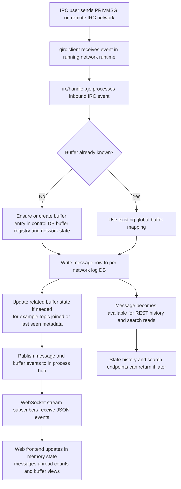

# IRC runtime and preview pipeline

This document covers the IRC client runtime, event persistence, and the URL preview pipeline that hooks off the message flow. See [ARCHITECTURE.md](ARCHITECTURE.md) for the overview, [storage.md](storage.md) for the DB layout, and [websocket-protocol.md](websocket-protocol.md) for the events published downstream.

## IRC runtime architecture

`irc.Manager` owns:

- IRC connection runtimes per network
- current per-network connection state
- methods for send/join/part
- outbound message logging

Each running network has:

- a cancellable runtime context
- a `girc.Client`
- an event handler that persists inbound IRC events and publishes hub events

Observed connection states include:

- `connecting`
- `connected`
- `disconnected`

## Event persistence model

Inbound IRC events are handled in `irc/handler.go`.

The handler is responsible for:

- ensuring buffers exist
- writing messages to the correct network log DB
- updating buffer state like topic/joined
- publishing stream events to the hub

Outbound messages are also persisted through `Manager.LogOutbound()` because the connected IRC servers may not provide echo-message in a way the app can rely on.

## Normal IRC message flow

## URL preview pipeline

The `preview/` package resolves HTTP(S) URLs mentioned in user-authored messages into inline previews (images + OpenGraph cards). The pipeline is deliberately off the message hot path:

1. `irc/handler.go` and `irc.Manager.LogOutbound` call `PreviewEnqueuer.Enqueue(networkID, bufferID, messageID, content)` only for kinds `privmsg`, `notice`, `action`. System events (joins, modes, etc.) are skipped.
2. `preview.Service` owns a bounded worker pool (default 4, configurable). Enqueue is non-blocking: a full queue drops the job with a warning rather than stalling IRC handling.
3. For each worker pickup: `ExtractURLs` pulls de-duplicated URLs in message order. For every URL, the worker consults `db.PreviewStore` (the shared `previews.db`) first, honoring `CacheTTL`. On miss, `Fetcher.Fetch` runs the SSRF guard, does a HEAD, and classifies:
   - `image/*` → `kind=image` preview
   - `text/html` → bounded GET capped by `MaxBytes`, parsed for `og:*` meta (falls back to `<title>`)
   - anything else → `kind=none`
   - fetch/SSRF errors → `kind=error`
   YouTube URLs (`youtube.com/watch`, `/shorts/`, `/live/`, `/embed/`, `youtu.be/*`) take a shortcut to the public `youtube.com/oembed` endpoint because the HTML page strips OG tags for non-browser user-agents.
4. Every fetch is written back to `url_previews` (including negative results, to prevent retry storms).
5. `(message_id, url, position)` associations are written to the per-network log DB's `message_previews` table.
6. Only `image`/`opengraph` results are then published as a `preview` event on the hub; the WebSocket writer forwards it verbatim.

On reload, `/api/state` and history endpoints re-attach previews to each `messageDTO` via `Server.attachPreviews`, which groups messages by network, reads `message_previews` from each log DB, and batch-loads the URL rows from `previews.db` with a single `GetMany`. No network calls happen on the read path.

Security notes (all non-negotiable):

- SSRF guard rejects loopback, RFC1918, link-local, multicast, CGNAT, and non-80/443 ports; runs on the initial URL and on every redirect hop
- redirects are capped at 3 via `CheckRedirect`
- body size is capped by `io.LimitReader(resp.Body, MaxBytes)`
- the HTTP client uses a configurable timeout (`Timeout` field, default 5 s)
- the frontend renders OG text via `textContent` only — never `innerHTML` — so OG strings cannot inject markup

Configuration (YAML block `previews:` in `config.yaml`, populates `config.PreviewConfig`):

- `enabled` — set to `false` to disable Enqueue entirely, no workers run
- `max_bytes` — cap per GET (default 512 KiB)
- `timeout_ms` — per-request deadline (default 5000)
- `cache_ttl_hours` — how long a cached row is considered fresh (default 168 = 7 d)
- `workers` — worker pool size (default 4)

Operational tips:

- wiping the preview cache is safe: stop the service, `rm data/previews.db`, restart. Message history is untouched; the `message_previews` link rows stay and will re-populate as URLs are re-fetched on demand (new messages only — there is no backfill job yet).
- error rows are cached under the same TTL as successes. After changing the user-agent or unblocking a host, clear affected rows manually (`DELETE FROM url_previews WHERE ...`) to force re-fetch.

## Event hub and streaming model

`hub/` provides in-process fanout from backend events to connected WebSocket clients.

Backend producers include:

- IRC message persistence
- buffer creation
- buffer state changes
- network state changes
- member list publication

The WebSocket endpoint subscribes to the hub and forwards events as JSON. See [websocket-protocol.md](websocket-protocol.md) for the wire format.
